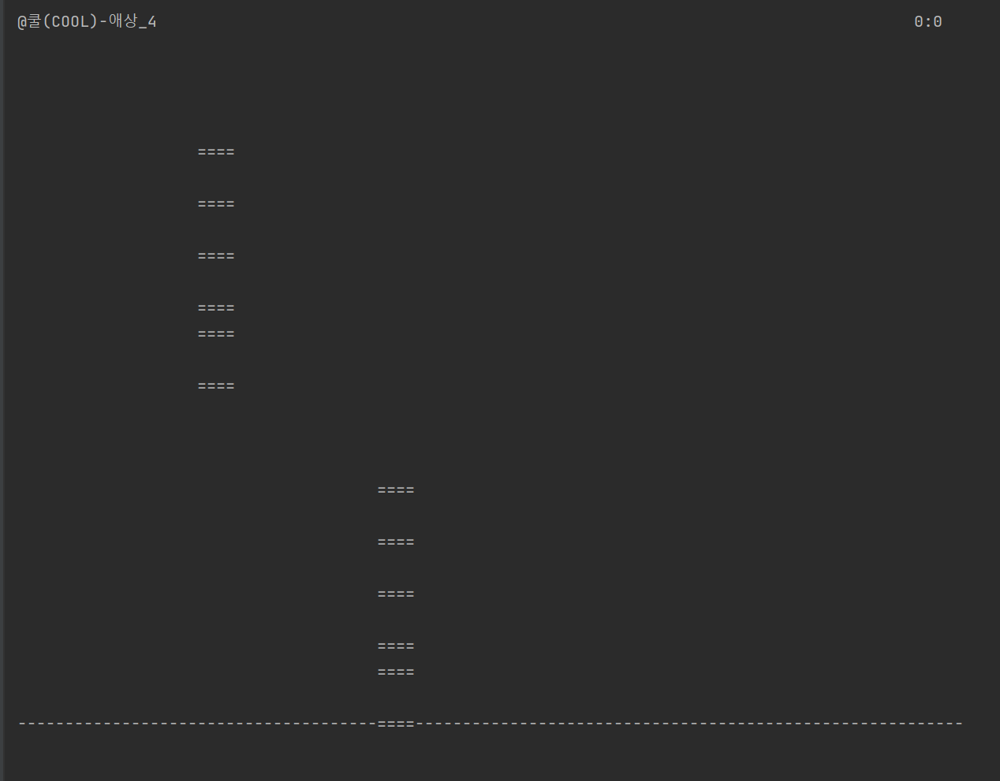

# JAVA Final Project : Rhythm Game

### Project Member : 22100699 DoHyeon Cho (조도현)

 

The topic I selected for my Java final project is creating a rhythm game. 
I enjoy rhythm games, and I thought it would be fun to create one myself. 
Additionally, I believe making the program run in the "cmd" rather than a GUI would make it a more unique program.

Here is the diagram of my project. 
The Main class handles the selection of play mode and the music to be played.
The Scheduler class is responsible for running the rhythm game.
The MakeMusicNote class provides functionality for creating notes for the selected music.
The KeyCheck_And_MusicPlay class handles music playback and key input.
Finally, the Display class outputs the game screen.
These five classes interact with each other to form the program.

Let me explain how to use the program.
When the program starts, user can choose between "Play Mode", "Make Mode", and "Exit".

"Play Mode" allows user to play a pre-made music note.
In [ Select Music ], user can select a music file from the music_ori folder to play.
In [ Select Difficulty ], user can choose the game's difficulty level.

Once the game starts, the user can use the A, S, K, and L keys to hit the notes falling from four lanes in time with the music to score points.
User can press the q key to exit the game early.

The game ends either when the song finishes or when the q key is pressed.
After the game ends, it displays the game information and the score the user achieved.
Then, it returns to the main class to select the game mode again.

Next, Let me explain what happens when user select "Make Mode".
In "Make Mode", similar to "Play Mode", user select a music file from the music_ori folder in [ Select Music ].
In [ Select Difficulty ], user choose the game's difficulty level.

After making user's selections, user can create notes for the selected song and selected difficulty level.
The notes created by the user are saved as a text file, which can then be used in "Play Mode".

To exit the game, select "Exit" in [ Select Mode ] to terminate the program.

